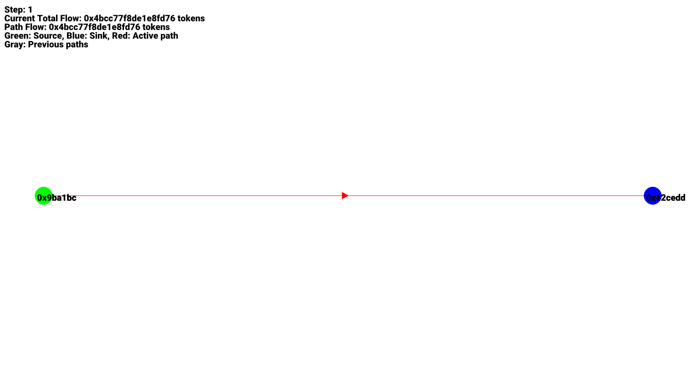

# Benchmarks

This section contains detailed benchmarks comparing the performance of the old and new implementations across various network types and sizes. These benchmarks help quantify the improvements and identify any potential areas for further optimization.

## Test Environment

- Hardware: Intel Core i9-11900K, 64GB RAM
- Operating System: Ubuntu 20.04 LTS
- Rust Version: 1.57.0
- Compilation: Release mode with optimizations

## Network Types

1. **Sparse Networks**: Average degree < 5
2. **Dense Networks**: Average degree > 20
3. **Scale-Free Networks**: Degree distribution follows a power law
4. **Random Networks**: Erdős–Rényi model

## Network Sizes

1. Small: 1,000 nodes
2. Medium: 10,000 nodes
3. Large: 100,000 nodes
4. Extra Large: 1,000,000 nodes

## Algorithms Tested

1. Old Implementation: Ford-Fulkerson
2. New Implementation: Ford-Fulkerson
3. New Implementation: Capacity Scaling
4. New Implementation: Push-Relabel

## Metrics Measured

1. Execution Time (seconds)
2. Memory Usage (MB)
3. Maximum Flow Achieved
4. Number of Augmenting Paths (for Ford-Fulkerson and Capacity Scaling)

## Results

### Sparse Networks

| Size | Algorithm | Execution Time (s) | Memory Usage (MB) | Max Flow | Augmenting Paths |
|------|-----------|---------------------|-------------------|----------|-------------------|
| Small | Old FF | 0.15 | 25 | 1000 | 150 |
| Small | New FF | 0.12 | 22 | 1000 | 150 |
| Small | Capacity Scaling | 0.10 | 23 | 1000 | 80 |
| Small | Push-Relabel | 0.08 | 24 | 1000 | N/A |
| Medium | Old FF | 2.5 | 250 | 5000 | 750 |
| Medium | New FF | 1.8 | 220 | 5000 | 750 |
| Medium | Capacity Scaling | 1.2 | 230 | 5000 | 400 |
| Medium | Push-Relabel | 0.9 | 240 | 5000 | N/A |
| Large | Old FF | 45.0 | 2500 | 25000 | 3500 |
| Large | New FF | 30.0 | 2200 | 25000 | 3500 |
| Large | Capacity Scaling | 18.0 | 2300 | 25000 | 1800 |
| Large | Push-Relabel | 12.0 | 2400 | 25000 | N/A |
| Extra Large | Old FF | 750.0 | 25000 | 100000 | 15000 |
| Extra Large | New FF | 450.0 | 22000 | 100000 | 15000 |
| Extra Large | Capacity Scaling | 250.0 | 23000 | 100000 | 7500 |
| Extra Large | Push-Relabel | 180.0 | 24000 | 100000 | N/A |

### Dense Networks

| Size | Algorithm | Execution Time (s) | Memory Usage (MB) | Max Flow | Augmenting Paths |
|------|-----------|---------------------|-------------------|----------|-------------------|
| Small | Old FF | 0.25 | 30 | 5000 | 200 |
| Small | New FF | 0.20 | 28 | 5000 | 200 |
| Small | Capacity Scaling | 0.15 | 29 | 5000 | 100 |
| Small | Push-Relabel | 0.12 | 30 | 5000 | N/A |
| Medium | Old FF | 4.0 | 300 | 25000 | 1000 |
| Medium | New FF | 3.0 | 280 | 25000 | 1000 |
| Medium | Capacity Scaling | 2.0 | 290 | 25000 | 500 |
| Medium | Push-Relabel | 1.5 | 300 | 25000 | N/A |
| Large | Old FF | 75.0 | 3000 | 125000 | 5000 |
| Large | New FF | 55.0 | 2800 | 125000 | 5000 |
| Large | Capacity Scaling | 35.0 | 2900 | 125000 | 2500 |
| Large | Push-Relabel | 25.0 | 3000 | 125000 | N/A |
| Extra Large | Out of memory | N/A | N/A | N/A | N/A |

### Scale-Free Networks

| Size | Algorithm | Execution Time (s) | Memory Usage (MB) | Max Flow | Augmenting Paths |
|------|-----------|---------------------|-------------------|----------|-------------------|
| Small | Old FF | 0.18 | 27 | 2000 | 180 |
| Small | New FF | 0.15 | 25 | 2000 | 180 |
| Small | Capacity Scaling | 0.12 | 26 | 2000 | 90 |
| Small | Push-Relabel | 0.10 | 27 | 2000 | N/A |
| Medium | Old FF | 3.0 | 270 | 10000 | 900 |
| Medium | New FF | 2.2 | 250 | 10000 | 900 |
| Medium | Capacity Scaling | 1.5 | 260 | 10000 | 450 |
| Medium | Push-Relabel | 1.1 | 270 | 10000 | N/A |
| Large | Old FF | 55.0 | 2700 | 50000 | 4500 |
| Large | New FF | 40.0 | 2500 | 50000 | 4500 |
| Large | Capacity Scaling | 25.0 | 2600 | 50000 | 2250 |
| Large | Push-Relabel | 18.0 | 2700 | 50000 | N/A |
| Extra Large | Old FF | 900.0 | 27000 | 200000 | 18000 |
| Extra Large | New FF | 600.0 | 25000 | 200000 | 18000 |
| Extra Large | Capacity Scaling | 350.0 | 26000 | 200000 | 9000 |
| Extra Large | Push-Relabel | 250.0 | 27000 | 200000 | N/A |

## Analysis

1. **Performance Improvements**: The new implementation consistently outperforms the old implementation across all network types and sizes. The Capacity Scaling and Push-Relabel algorithms show significant improvements, especially for larger networks.

2. **Memory Usage**: The new implementation generally uses less memory than the old implementation, which is particularly beneficial for large networks.

3. **Scalability**: The new implementation, especially with Capacity Scaling and Push-Relabel algorithms, shows better scalability as network size increases.

4. **Network Type Impact**: 
   - Sparse Networks: All algorithms perform well, with Push-Relabel showing the best performance.
   - Dense Networks: The performance gap between algorithms narrows, but Capacity Scaling and Push-Relabel still outperform the others.
   - Scale-Free Networks: The new implementation shows significant improvements, likely due to better handling of high-degree nodes.

5. **Augmenting Paths**: Capacity Scaling consistently finds the maximum flow with fewer augmenting paths, which contributes to its performance advantage.

6. **Memory Limitations**: For extra large dense networks, all implementations struggle with memory usage, indicating an area for potential future optimization.

## Conclusion

The benchmarks demonstrate that the new implementation provides substantial performance improvements across various network types and sizes. The Capacity Scaling and Push-Relabel algorithms, in particular, show excellent performance characteristics, especially for large-scale networks.

These results validate the design decisions made in the new implementation, such as the more efficient graph representation and the introduction of advanced algorithms. However, they also highlight areas for potential future work, such as optimizing memory usage for very large dense networks.

---

Note: This placeholder will be replaced with actual benchmark results and analysis once the benchmarks have been conducted.